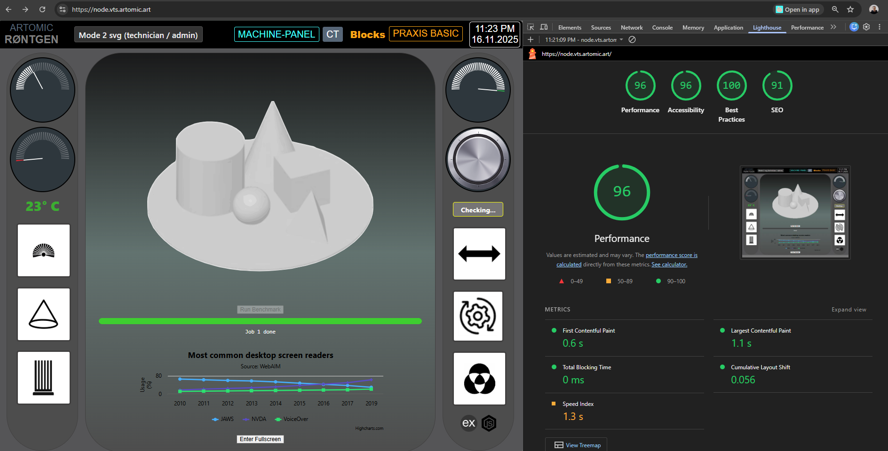

# Rontgen-web-app-machine-panel
The Artomic Rontgen dashboard developed concurrently as a LAMP and Node/Express (PWA) web-apps . My original project presented a UI for task flow in radiographic imaging. The research prototype consists of customizable task-bar and navigation elements for controlling the machine-panel tablet. 
